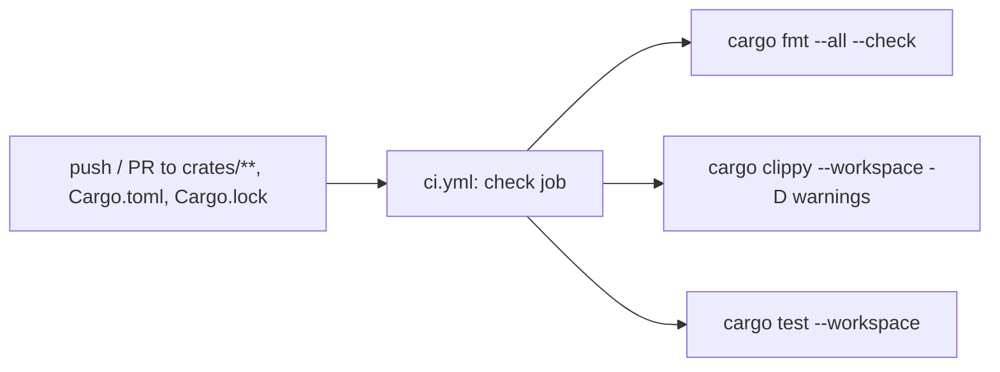
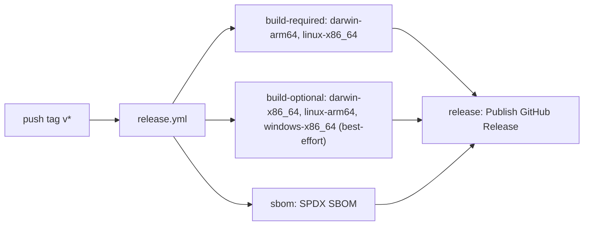

# CI/CD

At the end you will know what each of the product's two GitHub Actions
workflows does, how they fit together, and the real failures hit while
proving the release pipeline end to end — not just the happy path.

`datagov` has two workflows outside the docs-publishing one covered in
[Deployment](deployment.md): [`ci.yml`](https://github.com/senthilsweb/datagov/blob/main/.github/workflows/ci.yml)
(quality gates on every push/PR) and
[`release.yml`](https://github.com/senthilsweb/datagov/blob/main/.github/workflows/release.yml)
(tag-driven binary releases).

## CI workflow: quality gates (ci.yml)

Path-filtered to `crates/**`, `Cargo.toml`, `Cargo.lock`,
`rust-toolchain.toml`, and its own path — a docs-only commit never
triggers it. A guard step skips the whole job gracefully if
`Cargo.toml` doesn't exist yet (a holdover from before Bolt 1 landed
the workspace; harmless now that it does).

## Release workflow: tag-driven binary releases (release.yml)

`darwin-arm64` and `linux-x86_64` are the required targets for 0.1
(per the release-distribution spec); the rest are best-effort. The
`release` job's condition explicitly checks only `build-required` and
`sbom` succeeded, with `!cancelled()` overriding GitHub's default
all-needs-must-succeed gating — see why below.

## Failures seen so far

Four `fix(ci):` commits landed on 2026-07-26 while proving the release
pipeline against real tags (`v0.1.0-rc.1` through `rc.4`), each fixing
a problem the previous run actually hit:

| Time | Commit | What happened | Fix |
|---|---|---|---|
| 11:34 | [`e6d80d5`](https://github.com/senthilsweb/datagov/commit/e6d80d58083f479a5685230c9db1c14c9b284705) | A tag like `v0.1.0-rc.1` would display as "Latest" on GitHub, which is wrong for a pre-release snapshot ahead of Milestone 0.1 completion. | Detect a hyphenated tag (`rc`/`alpha`/`beta`) and set `prerelease: true` on the GitHub Release. |
| 12:30 | [`d2de1ec`](https://github.com/senthilsweb/datagov/commit/d2de1ece96955f43f721283a1554793b1a093f45) | Observed on `rc.1`: the `macos-13` (`darwin-x86_64`) runner queued 50+ minutes with no capacity while the other four legs finished in under 3 minutes each, and the release job waited on the *entire* build matrix regardless of individual leg outcome — one slow best-effort runner stalled the whole release indefinitely. | Tag each matrix target `required: true/false` (darwin-arm64 + linux-x86_64 required, the rest best-effort per PRD §29); `continue-on-error` set per leg from that flag; every leg gets a 20-minute timeout. |
| 13:10 | [`24aaac6`](https://github.com/senthilsweb/datagov/commit/24aaac600aafcd9f896ba553d432077faaa36646) | Two *consecutive* release runs (`rc.1`, `rc.2`) both queued 39–54+ minutes on `macos-13` with no runner ever assigned — a capacity problem specific to that runner pool, not something a timeout fixes (timeout only bounds execution time, not the queue wait before a runner exists). | Cross-compile `datagov-darwin-x86_64` from the same `macos-14` (Apple Silicon) runner already building `darwin-arm64`, instead of using the scarce Intel `macos-13` pool at all. |
| 13:33 | [`d9a6b1a`](https://github.com/senthilsweb/datagov/commit/d9a6b1a75c2975c003c344b967553fea19fd37c4) | `rc.3`'s `windows-x86_64` leg correctly timed out at 20 minutes (expected, best-effort) — but the "Publish GitHub Release" job was then **skipped entirely** rather than running. `continue-on-error` on one matrix leg does not make a downstream `needs:` job proceed, because GitHub collapses an entire matrix job's result into one worst-case value for `needs.<job>.result`; a downstream job can't tell "a required leg failed" from "only a best-effort leg failed" when they share one matrix. | Split the single `build` job into separate `build-required` (no `continue-on-error`, blocks the release normally) and `build-optional` (`continue-on-error: true`) jobs. The `release` job's `if` checks only `build-required` and `sbom` succeeded, with `!cancelled()` overriding the default gating so `build-optional`'s expected failures never skip it. |

`v0.1.0-rc.4` published clean afterward: both required targets
succeeded, both best-effort Unix/ARM targets succeeded, the
best-effort Windows target timed out without blocking the release, and
the SBOM + checksums attached correctly with `prerelease: true` set.
`v0.1.0-rc.5` (the current latest tag) followed the same green path.

Next: [Deployment](deployment.md) for how this documentation site
itself — a separate, unrelated pipeline — gets built and published.
