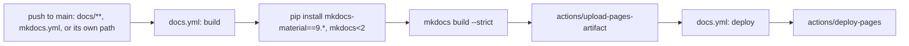

# Deployment

At the end you will know how this documentation site itself gets
built and published — distinct from [CI/CD](ci-cd.md), which covers
the `datagov` product's own quality gates and binary releases. This
page is about the wiki you're reading, not the CLI.

## How a docs change goes live



[`.github/workflows/docs.yml`](https://github.com/senthilsweb/datagov/blob/main/.github/workflows/docs.yml)
triggers only on `docs/**`, `mkdocs.yml`, and its own path — a
docs-only commit never runs `ci.yml` or `release.yml`, and a
code-only commit never runs this workflow. `mkdocs build --strict`
means a broken internal link (a wiki page linking to a page that
doesn't exist) fails the build rather than publishing silently.

## Preview a change locally before pushing

```bash
pip install "mkdocs-material==9.*" "mkdocs<2"
mkdocs serve
```

Opens a live-reloading local server (default `http://127.0.0.1:8000`)
that rebuilds as you edit files under `docs/`. Run
`mkdocs build --strict` once before pushing — it's the same command
CI runs, so a clean local build means CI won't fail on a broken link.

## Where GitHub Pages settings live

Settings → Pages → Source is set to **"GitHub Actions"** (not the
legacy branch/folder build this project used before this change) — the
workflow above is what actually publishes the site, not a background
Pages build watching a branch.

!!! note "This site is reachable at more than one URL"
    If the account's user-level GitHub Pages site has a custom domain
    configured, every project site — including this one — is served
    under that domain automatically, in parallel with the plain
    `senthilsweb.github.io/datagov/` URL, with no supported per-repo
    opt-out. `senthilsweb.github.io/datagov/` is the only URL this
    project documents or promotes; if you land here from the custom
    domain instead, you're seeing the same content. See
    `~/.claude/skills/mkdocs-site/SKILL.md`'s custom-domain-inheritance
    note for the full finding.

Next: [FAQ](faq.md) for short answers to already-resolved questions
about this project.
